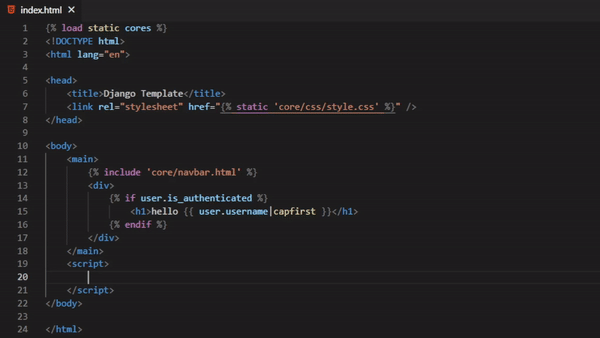

# Django support for Visual Studio Code

💥 The extension you were waiting for 💥

## Features

> 1\. Syntax Highlighting

Django template language syntax highlighting in **html** !

**Zero config** , No need to switch to **django-html** !

 

**If you love this extension, you could**

 

> 2\. Snippets

<!-- StartSnippets -->

### _**admin**_ / _**classes**_

| Trigger            | Description                     |
| ------------------ | ------------------------------- |
| `modeladmin`       | Class \- admin.ModelAdmin       |
| `simplelistfilter` | Class \- admin.SimpleListFilter |
| `stackedinline`    | Class \- admin.StackedInline    |
| `tabularinline`    | Class \- admin.TabularInline    |

### _**admin**_ / _**imports**_

| Trigger      | Description                                |
| ------------ | ------------------------------------------ |
| `iadmin`     | from django.contrib import admin           |
| `iadminsite` | from django.contrib.admin import AdminSite |

### _**admin**_ / _**methods**_

| Trigger      | Description                                                          |
| ------------ | -------------------------------------------------------------------- |
| `register`   | Method \- Register model without providing a ModelAdmin              |
| `registerd`  | Method \- Register model with providing a ModelAdmin using decorator |
| `registerma` | Method \- Register model providing a ModelAdmin                      |

### _**admin**_ / _**options**_

| Trigger     | Description                     |
| ----------- | ------------------------------- |
| `fieldsets` | Option \- Model admin fieldsets |

### _**forms**_ / _**classes**_

| Trigger     | Description              |
| ----------- | ------------------------ |
| `form`      | Class \- forms.Form      |
| `modelform` | Class \- forms.ModelForm |

### _**forms**_ / _**fields**_

| Trigger          | Description                                                                                                        |
| ---------------- | ------------------------------------------------------------------------------------------------------------------ |
| `fbool`          | Field \- forms.BooleanField                                                                                        |
| `fchar`          | Field \- forms.CharField                                                                                           |
| `fchoice`        | Field \- forms.ChoiceField                                                                                         |
| `fcombo`         | Field \- forms.ComboField                                                                                          |
| `fdate`          | Field \- forms.DateField                                                                                           |
| `fdaterange`     | Field \- forms.DateRangeField. \*PostgreSQL specific form fields\*.                                                |
| `fdatetime`      | Field \- forms.DateTimeField                                                                                       |
| `fdatetimerange` | Field \- forms.DateTimeRangeField. \*PostgreSQL specific form fields\*.                                            |
| `fdecimal`       | Field \- forms.DecimalField                                                                                        |
| `fduration`      | Field \- forms.DurationField                                                                                       |
| `femail`         | Field \- forms.EmailField                                                                                          |
| `ffile`          | Field \- forms.FileField                                                                                           |
| `ffilepath`      | Field \- forms.FilePathField                                                                                       |
| `ffloat`         | Field \- forms.FloatField                                                                                          |
| `ffloatrange`    | Field \- forms.FloatRangeField. \*PostgreSQL specific form fields\*.                                               |
| `fip`            | Field \- forms.IPAddressField                                                                                      |
| `fhstore`        | Field \- forms.HStoreField. \*PostgreSQL specific form fields\*.                                                   |
| `fimg`           | Field \- forms.ImageField                                                                                          |
| `fint`           | Field \- forms.IntegerField                                                                                        |
| `fintrange`      | Field \- forms.IntegerRangeField. \*PostgreSQL specific form fields\*.                                             |
| `fip`            | Field \- forms.IPAddressField. This field has been deprecated since version 1.7 in favor of GenericIPAddressField. |
| `fjson`          | Field \- forms.JSONField. \*PostgreSQL specific form fields\*.                                                     |
| `fmochoice`      | Field \- forms.ModelChoiceField                                                                                    |
| `fmomuchoice`    | Field \- forms.ModelMultipleChoiceField                                                                            |
| `fmuchoice`      | Field \- forms.MultipleChoiceField                                                                                 |
| `fmuval`         | Field \- forms.MultiValueField                                                                                     |
| `fnullbool`      | Field \- forms.NullBooleanField                                                                                    |
| `fregex`         | Field \- forms.RegexField                                                                                          |
| `fsdatetime`     | Field \- forms.SplitDateTimeField                                                                                  |
| `fsimplearray`   | Field \- forms.SimpleArrayField. \*PostgreSQL specific form fields\*.                                              |
| `fslug`          | Field \- forms.SlugField                                                                                           |
| `fsplitarray`    | Field \- forms.SplitArrayField. \*PostgreSQL specific form fields\*.                                               |
| `ftchoice`       | Field \- forms.TypedChoiceField                                                                                    |
| `ftime`          | Field \- forms.TimeField                                                                                           |
| `ftmuchoice`     | Field \- forms.TypedMultipleChoiceField                                                                            |
| `ftypedmuchoice` | Field \- forms.TypedMultipleChoiceField                                                                            |
| `furl`           | Field \- forms.URLField                                                                                            |
| `fuuid`          | Field \- forms.UUIDField                                                                                           |

### _**forms**_ / _**imports**_

| Trigger       | Description                      |
| ------------- | -------------------------------- |
| `iforms`      | from django import forms         |
| `ipostgresff` | PostgreSQL specific forms fields |

### _**forms**_ / _**methods**_

| Trigger          | Description                       |
| ---------------- | --------------------------------- |
| `clean_data`     | Method \- Form clean field        |
| `clean_password` | Method \- Form confirm password   |
| `fsave`          | Method \- Form custom save method |

### _**imports**_ / _**general**_

| Trigger      | Description                                    |
| ------------ | ---------------------------------------------- |
| `iappforms`  | Import \- app.forms                            |
| `iappmodels` | Import \- app.models                           |
| `iappviews`  | Import \- app.views                            |
| `isettings`  | from django.conf import settings               |
| `iusermodel` | from django.contrib.auth import get_user_model |

### _**models**_ / _**classes**_

| Trigger      | Description                     |
| ------------ | ------------------------------- |
| `Model`      | Class \- models.Model           |
| `ModelFull`  | Class \- models.Model \(full\)  |
| `ModelMixin` | Class \- models.Model \(mixin\) |
| `manager`    | Class \- models.Manager         |
| `queryset`   | Class \- models.QuerySet        |

### _**models**_ / _**fields**_

| Trigger        | Description                                                                                                                                                     |
| -------------- | --------------------------------------------------------------------------------------------------------------------------------------------------------------- |
| `fk`           | Field \- models.ForeignKey \( A many\-to\-one relationship.on_delete will become a required argument in Django 2.0. In older versions it defaults to CASCADE\)  |
| `m2m`          | Field \- models.ManyToManyField \( A many\-to\-many relationship\)                                                                                              |
| `marray`       | Field \- models.ArrayField \(PostgreSQL specific model fields\*.A field for storing lists of data\)                                                             |
| `mauto`        | Field \- models.AutoField \(An IntegerField that automatically increments according to available IDs\)                                                          |
| `mbigauto`     | Field \- models.BigAutoField \(\[New in Django 1.10.\]A 64\-bit integer, much like an AutoField\)                                                               |
| `mbigint`      | Field \- models.BigIntegerField \(A 64\-bit integer, much like an IntegerField\)                                                                                |
| `mbinary`      | Field \- models.BinaryField \(A field to store raw binary data\)                                                                                                |
| `mbool`        | Field \- models.BooleanField \(A true\/false field\)                                                                                                            |
| `mchar`        | Field \- models.CharField                                                                                                                                       |
| `mcoseint`     | Field \- models.CommaSeparatedIntegerField \(This field is deprecated since 1.9 in favor of CharField with validators\)                                         |
| `mdate`        | Field \- models.DateField \(A date, represented in Python by a datetime.date instance\)                                                                         |
| `mdatetime`    | Field \- models.DateTimeField \(A date, represented in Python by a datetime.datetime instance\)                                                                 |
| `mdecimal`     | Field \- models.DecimalField \(A fixed\-precision decimal number, represented in Python by a Decimal instance\)                                                 |
| `mduration`    | Field \- models.DurationField \(A field for storing periods of time \- modeled in Python by timedelta\)                                                         |
| `memail`       | Field \- models.EmailField \(A CharField that checks that the value is a valid email address\)                                                                  |
| `mfile`        | Field \- models.FileField \(A file\-upload field\)                                                                                                              |
| `mfilepath`    | Field \- models.FilePathField \(A CharField whose choices are limited to the filenames in a certain directory on the filesystem\)                               |
| `mfloat`       | Field \- models.FloatField \(A floating\-point number represented in Python by a float instance\)                                                               |
| `mgenericip`   | Field \- models.GenericIPAddressField \(An IPv4 or IPv6 address, in string format\)                                                                             |
| `mimg`         | Field \- models.ImageField \(Inherits all attributes and methods from FileField, but also validates that the uploaded object is a valid image\)                 |
| `mint`         | Field \- models.IntegerField \(An integer. Values from \-2147483648 to 2147483647 are safe in all databases supported by Django\)                               |
| `mip`          | Field \- models.IPAddressField \(This field has been deprecated since version 1.7 in favor of GenericIPAddressField\)                                           |
| `mjson`        | Field \- models.JSONField \(PostgreSQL specific model fields\*.\[New in Django 1.11.\]A field for storing JSON encoded data\)                                   |
| `mnullbool`    | Field \- models.NullBooleanField \(Like a BooleanField, but allows NULL as one of the options\)                                                                 |
| `mo2o`         | Field \- models.OneToOneField \(A one\-to\-one relationship.on_delete will become a required argument in Django 2.0. In older versions it defaults to CASCADE\) |
| `mphone`       | Field \- models.PhoneNumberField \(external package: django\-phonenumber\-field\)                                                                               |
| `mposint`      | Field \- models.PositiveIntegerField \(Like an IntegerField, but must be either positive or zero \(\)                                                           |
| `mpossmallint` | Field \- models.PositiveSmallIntegerField \(Like a PositiveIntegerField, but only allows values under a certain \(database\-dependent\) point\)                 |
| `mslug`        | Field \- models.SlugField \(A slug is a short label for something, containing only letters, numbers, underscores or hyphens. They’re generally used in URLs\)   |
| `msmallint`    | Field \- models.SmallIntegerField \(Like an IntegerField, but only allows values under a certain \(database\-dependent\) point\)                                |
| `mstore`       | Field \- models.HStoreField \(PostgreSQL specific model fields\*.A field for storing key\-value pairs. The Python data type used is a dict\)                    |
| `mtext`        | Field \- models.TextField \(A large text field\)                                                                                                                |
| `mtime`        | Field \- models.TimeField \(A time, represented in Python by a datetime.time instance\)                                                                         |
| `murl`         | Field \- models.URLField \(A CharField for a URL\)                                                                                                              |
| `musstate`     | Field \- models.USStateField \(external package: django\-localflavor\)                                                                                          |
| `muuid`        | Field \- models.UUIDField \(A field for storing universally unique identifiers. Uses Python’s UUID class\)                                                      |
| `mxml`         | Field \- models.XMLField \(All uses of XMLField can be replaced with TextField. This field has been deprecated since version 1.3\)                              |

### _**models**_ / _**imports**_

| Trigger        | Description                                                                 |
| -------------- | --------------------------------------------------------------------------- |
| `iappmanagers` | Import \- managers                                                          |
| `imodels`      | from django.db import models                                                |
| `ipostgresmf`  | from django.contrib.postgres.fields                                         |
| `iuc`          | For forwards compatibility, this decorator is available as of Django 1.4.2. |
| `isignals`     | from django.db.models.signals                                               |

### _**models**_ / _**methods**_

| Trigger            | Description                |
| ------------------ | -------------------------- |
| `get_absolute_url` | Method \- get_absolute_url |
| `receiver`         | Method \- receiver         |
| `str`              | Method \- \_\_str\_\_      |

### _**python**_ / _**imports**_

| Trigger      | Description                                 |
| ------------ | ------------------------------------------- |
| `inpdb`      | Import \- nose pdb debug tool               |
| `ipdb`       | Import \- ipdb debug tool                   |
| `itraceback` | Import \- traceback print exception         |
| `iul`        | from \_\_future\_\_ import unicode_literals |

### _**python**_ / _**methods**_

| Trigger    | Description             |
| ---------- | ----------------------- |
| `__init__` | Methods \- \_\_init\_\_ |

### _**templates**_ / _**filters**_

| Trigger                | Description                      |
| ---------------------- | -------------------------------- |
| `\|add`                | Filter \- add                    |
| `\|addslashes`         | Filter \- addslashes             |
| `\|capfirst`           | Filter \- capfirst               |
| `\|center`             | Filter \- center:Arg             |
| `\|cut`                | Filter \- cut:Arg                |
| `\|date`               | Filter \- date                   |
| `\|default`            | Filter \- default:Arg            |
| `\|default_if_none`    | Filter \- default_if_none:Arg    |
| `\|dictsort`           | Filter \- dictsort:Arg           |
| `\|dictsortreversed`   | Filter \- dictsortreversed:Arg   |
| `\|divisibleby`        | Filter \- divisibleby:Arg        |
| `\|escape`             | Filter \- escape                 |
| `\|escapejs`           | Filter \- escapejs               |
| `\|filesizeformat`     | Filter \- filesizeformat         |
| `\|first`              | Filter \- first                  |
| `\|floatformat`        | Filter \- floatformat            |
| `\|force_escape`       | Filter \- force_escape           |
| `\|get_digit`          | Filter \- get_digit              |
| `\|iriencode`          | Filter \- iriencode              |
| `\|join`               | Filter \- join:Arg               |
| `\|last`               | Filter \- last                   |
| `\|length`             | Filter \- length                 |
| `\|length_is`          | Filter \- length_is:Arg          |
| `\|linebreaks`         | Filter \- linebreaks             |
| `\|linebreaksbr`       | Filter \- linebreaksbr           |
| `\|linenumbers`        | Filter \- linenumbers            |
| `\|ljust`              | Filter \- ljust                  |
| `\|lower`              | Filter \- lower                  |
| `\|make_list`          | Filter \- make_list              |
| `\|phone2numeric`      | Filter \- phone2numeric          |
| `\|pluralize`          | Filter \- pluralize              |
| `\|pprint`             | Filter \- pprint                 |
| `\|random`             | Filter \- random                 |
| `\|rjust`              | Filter \- rjust                  |
| `\|safe`               | Filter \- safe                   |
| `\|safeseq`            | Filter \- safeseq                |
| `\|slice`              | Filter \- slice:Arg              |
| `\|slugify`            | Filter \- slugify                |
| `\|stringformat`       | Filter \- stringformat           |
| `\|striptags`          | Filter \- striptags              |
| `\|time`               | Filter \- time:Arg               |
| `\|timesince`          | Filter \- timesince:Arg          |
| `\|timeuntil`          | Filter \- timeuntil:Arg          |
| `\|title`              | Filter \- title                  |
| `\|truncatechars`      | Filter \- truncatechars:Arg      |
| `\|truncatechars_html` | Filter \- truncatechars_html:Arg |
| `\|truncatewords`      | Filter \- truncatewords:Arg      |
| `\|truncatewords_html` | Filter \- truncatewords_html:Arg |
| `\|unordered_list`     | Filter \- unordered_list         |
| `\|upper`              | Filter \- upper                  |
| `\|urlencode`          | Filter \- urlencode              |
| `\|urlize`             | Filter \- urlize                 |
| `\|urlizetrunc`        | Filter \- urlizetrunc            |
| `\|wordcount`          | Filter \- wordcount              |
| `\|wordwrap`           | Filter \- wordwrap               |
| `\|yesno`              | Filter \- yesno:Arg              |

### _**templates**_ / _**imports**_

| Trigger   | Description    |
| --------- | -------------- |
| `li18n`   | Load \- i18n   |
| `load`    | Load \- any    |
| `lstatic` | Load \- static |

### _**templates**_ / _**tags**_

| Trigger                     | Description                                                   |
| --------------------------- | ------------------------------------------------------------- |
| `autoescape`                | \{% autoescape %\} \{% endautoescape %\}                      |
| `autoescape_paste`          | \{% autoescape %\} \(paste\) \{% endautoescape %\}            |
| `block`                     | \{% block %\} \{% endblock %\}                                |
| `block_paste`               | \{% block %\} \(paste\) \{% endblock %\}                      |
| `blocktrans`                | \{% blocktrans %\} \{% endblocktrans %\}                      |
| `blocktrans_paste`          | \{% blocktrans %\} \(paste\) \{% endblocktrans %\}            |
| `blocktrans_with`           | \{% blocktrans with %\} \{% endblocktrans %\}                 |
| `blocktrans_with_paste`     | \{% blocktrans with %\} \(paste\) \{% endblocktrans %\}       |
| `blocktranslate`            | \{% blocktranslate %\} \{% endblocktranslate %\}              |
| `blocktranslate_paste`      | \{% blocktranslate %\} \(paste\) \{% endblocktranslate %\}    |
| `blocktranslate_with`       | \{% blocktranslate as %\} \{% endblocktranslate %\}           |
| `blocktranslate_with_paste` | \{% blocktranslate as %\} \(paste\) \{% endblocktranslate %\} |
| `comment`                   | \{\# \#\}                                                     |
| `comment_block`             | \{% comment %\} \{% endcomment %\}                            |
| `comment_paste`             | \{% comment %\} \(paste\) \{% endcomment %\}                  |
| `csrf_token`                | \{% csrf_token %\}                                            |
| `cycle`                     | \{% cycle %\}                                                 |
| `debug`                     | \{% debug %\}                                                 |
| `elif`                      | \{% elif %\}                                                  |
| `else`                      | \{% else %\}                                                  |
| `endautoescape`             | \{% endautoescape %\}                                         |
| `endblock`                  | \{% endblock %\}                                              |
| `endcomment`                | \{% endcomment %\}                                            |
| `endfilter`                 | \{% endfilter %\}                                             |
| `endfor`                    | \{% endfor %\}                                                |
| `endif`                     | \{% endif %\}                                                 |
| `endifchanged`              | \{% endifchanged %\}                                          |
| `endspaceless`              | \{% endspaceless %\}                                          |
| `endverbatim`               | \{% endverbatim %\}                                           |
| `endwith`                   | \{% endwith %\}                                               |
| `extends`                   | \{% extends '...' %\}                                         |
| `filter`                    | \{% filter %\} \{% endfilter %\}                              |
| `filter_paste`              | \{% filter %\} \(paste\) \{% endfilter %\}                    |
| `firstof`                   | \{% firstof %\}                                               |
| `for`                       | \{% for %\} \{% endfor %\}                                    |
| `for_paste`                 | \{% for %\} \(paste\) \{% endfor %\}                          |
| `forempty`                  | \{% forempty %\} \{% empty %\} \{% endfor %\}                 |
| `forempty_paste`            | \{% forempty %\} \(paste\) \{% empty %\} \{% endfor %\}       |
| `if`                        | \{% if %\} \{% endif %\}                                      |
| `if_paste`                  | \{% if %\} \(paste\) \{% endif %\}                            |
| `ifchanged`                 | \{% ifchanged %\} \{% endifchanged %\}                        |
| `ifchanged_paste`           | \{% ifchanged %\} \(paste\) \{% endifchanged %\}              |
| `ifelse`                    | \{% if %\} \{% else %\} \{% endif %\}                         |
| `ifelse_paste`              | \{% if %\} \(paste\) \{% else %\} \{% endif %\}               |
| `include`                   | \{% include '...' %\}                                         |
| `lorem`                     | \{% lorem %\}                                                 |
| `now`                       | \{% now %\}                                                   |
| `regroup`                   | \{% regroup %\}                                               |
| `regroup_example`           | \{% regroup %\} \(example\)                                   |
| `resetcycle`                | \{% resetcycle %\}                                            |
| `spaceless`                 | \{% spaceless %\} \{% endspaceless %\}                        |
| `spaceless_paste`           | \{% spaceless %\} \(paste\) \{% endspaceless %\}              |
| `static`                    | \{% static '...' %\}                                          |
| `static_paste`              | \{% static '\(paste\)' %\}                                    |
| `tag`                       | \{% tag %\}                                                   |
| `templatetag`               | \{% templatetag %\}                                           |
| `translate`                 | \{% translate '' %\}                                          |
| `translate_paste`           | \{% translate '\(paste\)' %\}                                 |
| `url`                       | \{% url '...' %\}                                             |
| `urlas`                     | \{% url '...' as var %\}                                      |
| `urlpk`                     | \{% url '...' pk=object.pk %\}                                |
| `urlslug`                   | \{% url '...' slug=object.slug %\}                            |
| `verbatim`                  | \{% verbatim %\} \{% endverbatim %\}                          |
| `verbatim_paste`            | \{% verbatim %\} \(paste\) \{% endverbatim %\}                |
| `widthratio`                | \{% widthratio %\}                                            |
| `with`                      | \{% with %\} \{% endwith %\}                                  |
| `with_paste`                | \{% with %\} \(paste\) \{% endwith %\}                        |

### _**templates**_ / _**variables**_

| Trigger    | Description             |
| ---------- | ----------------------- |
| `super`    | Variable \- block.super |
| `username` | Variable \- username    |
| `variable` | Variable \- empty       |

### _**templatetags**_ / _**functions**_

| Trigger                   | Description              |
| ------------------------- | ------------------------ |
| `register_assignment_tag` | Custom Tag \- Assignment |
| `register_filter`         | Custom Filter \- Regular |
| `register_inclusion_tag`  | Custom Tag \- Inclusion  |
| `register_simple_tag`     | Custom Tag \- Simple     |

### _**templatetags**_ / _**imports**_

| Trigger           | Description                         |
| ----------------- | ----------------------------------- |
| `idefaultfilters` | from django.template.defaultfilters |
| `ilib`            | TemplateTags \- Import Library      |

### _**urls**_ / _**imports**_

| Trigger         | Description                                          |
| --------------- | ---------------------------------------------------- |
| `iconf_urls`    | Utility functions for use in URLconfs.               |
| `iconf_urls`    | Utilityfunctions for use in URLconfs.                |
| `iurlresolvers` | \*Deprecated since version 1.10\* Utility functions. |
| `iurls`         | Utility functions for use in URLconfs.               |
| `iurls`         | Utility functions for use in URLconfs.               |

### _**urls**_ / _**methods**_

| Trigger       | Description                        |
| ------------- | ---------------------------------- |
| `path_inline` | Route \- path\(route, view, name\) |
| `path_stack`  | Route \- path\(route, view, name\) |
| `url_inline`  | Route \- url\(regex, view, name\)  |
| `url_stack`   | Route \- url\(regex, view, name\)  |
| `urlpatterns` | urlpatterns = \[\]                 |

### _**urls**_ / _**regexes**_

| Trigger      | Description           |
| ------------ | --------------------- |
| `repk`       | Regex \- PK URL       |
| `reslug`     | Regex \- Slug URL     |
| `reusername` | Regex \- Username URL |

### _**views**_ / _**classes**_

| Trigger        | Description                    |
| -------------- | ------------------------------ |
| `createview`   | View \- class \(CreateView\)   |
| `deleteview`   | View \- class \(DeleteView\)   |
| `detailview`   | View \- class \(DetailView\)   |
| `listview`     | View \- class \(ListView\)     |
| `templateview` | View \- class \(TemplateView\) |
| `updateview`   | View \- class \(UpdateView\)   |

### _**views**_ / _**functions**_

| Trigger   | Description                       |
| --------- | --------------------------------- |
| `view`    | View \- function \(render\)       |
| `view_hr` | View \- function \(httpResponse\) |

### _**views**_ / _**imports**_

| Trigger         | Description                          |
| --------------- | ------------------------------------ |
| `igenericviews` | from django.views.generic            |
| `ihttpresponse` | from django.http import HttpResponse |
| `imessages`     | from django.contrib import messages  |
| `irender`       | from django.shortcuts import render  |
| `ivdcache`      | from django.views.decorators.http    |
| `ivdhttp`       | from django.views.decorators.http    |

### _**views**_ / _**methods**_

| Trigger            | Description                |
| ------------------ | -------------------------- |
| `dispatch`         | Method \- dispatch         |
| `get_context_data` | Method \- get_context_data |
| `get_queryset`     | Method \- get_queryset     |

<!-- EndSnippets -->

## Installation

1. From vscode

   - Go to `Extensions` (Ctrl+Shift+X)
   - Search for `Django Support` by (**Al Mahdi**)
   - Click `Install`

2. From marketplace

   - Go to [Django Support](https://marketplace.visualstudio.com/items?itemName=almahdi.code-django) by (**Al Mahdi**)
   - Click `Install`

3. From cli

   - Open terminal
   - Enter : `code --install-extension almahdi.code-django`

## Known Issues

Currently no known issues

## Release Notes

See all the release notes here in [Changelog](https://github.com/devmahdi404/code-django/blob/main/CHANGELOG.md)

## Contributing

Pull requests are welcome.

Please see our [contributing guide](https://github.com/devmahdi404/code-django/blob/main/CONTRIBUTING.md) for more details

## Credits

- Snippets in this extension was initially copied from [djaneiro](https://github.com/ScottBarkman/vscode-djaneiro)

## License

This project is licensed under [MIT License](https://github.com/devmahdi404/code-django/blob/main/LICENSE)

---

**Enjoy!** 😎
